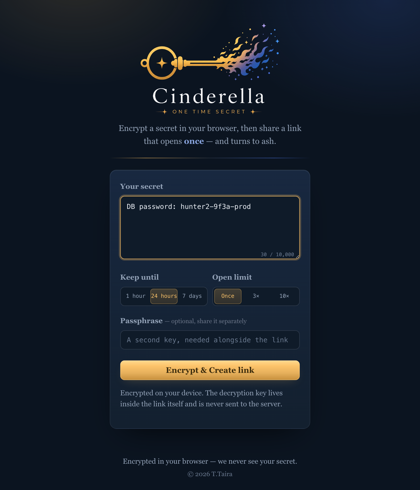
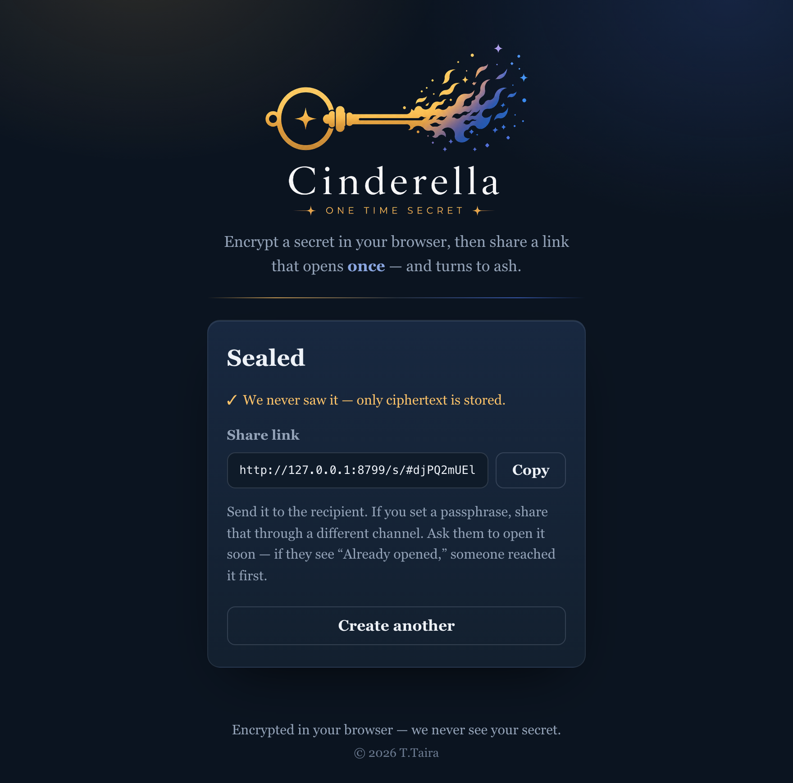
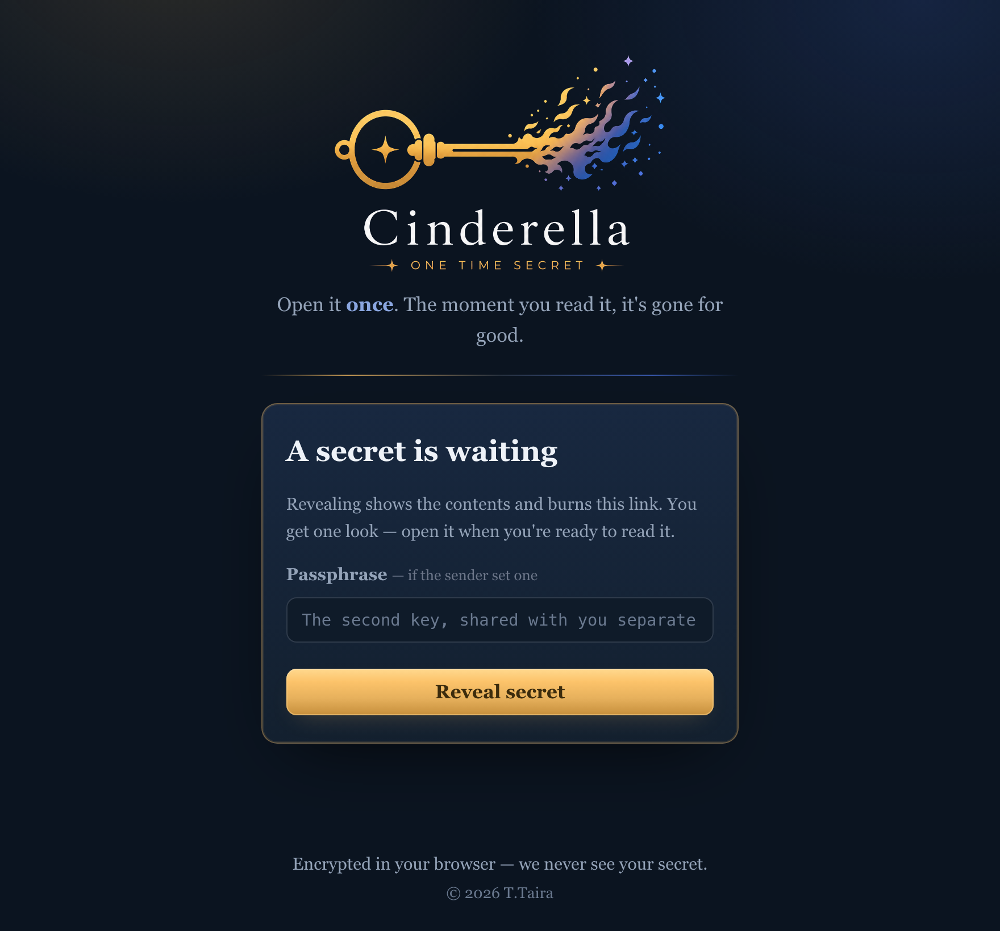
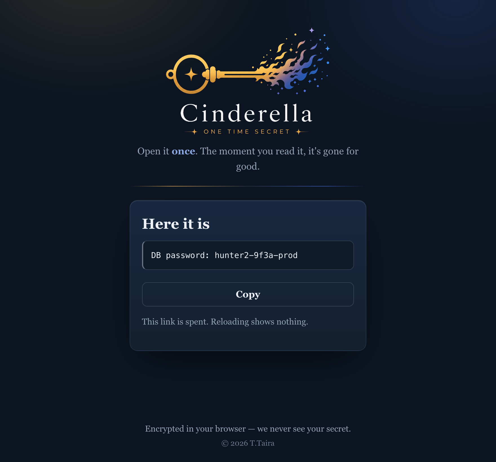

  

<b>Share a secret through a link that opens once — then turns to ash.</b>

Send a password or API key through a link that can be opened **only once**.
The secret is encrypted in your browser, so **the server never sees its contents**.
The moment the recipient opens the link, it is shown to them and destroyed.

## How it works

1. **Type your secret** — a password, an API key, or a short note.
2. **Choose how long it lasts** (1 hour / 24 hours / 7 days) and **how many times it can be opened** (1 / 3 / 10).
3. *(Optional)* Set a **passphrase** and share it through a different channel.
4. Press **Encrypt & Create link**, then send the link to the recipient.
5. They open the link and press **Reveal** — the secret is shown **once** and erased from the server.
6. After that, the link shows **“Already opened.”** If the recipient sees that before their first look, someone reached it first — tell the sender and rotate the secret.

  
  

  
  

## Why it's safe

- Encryption and decryption happen **only in your browser**. The decryption key lives in the part of the link after `#`, which browsers never send to the server.
- So even if the server or its logs leak, **the contents cannot be read**.
- Because it is destroyed on first open, it resists link reuse and interception.
- For sensitive secrets, share a passphrase through a separate channel — then even a leaked link cannot be opened.
